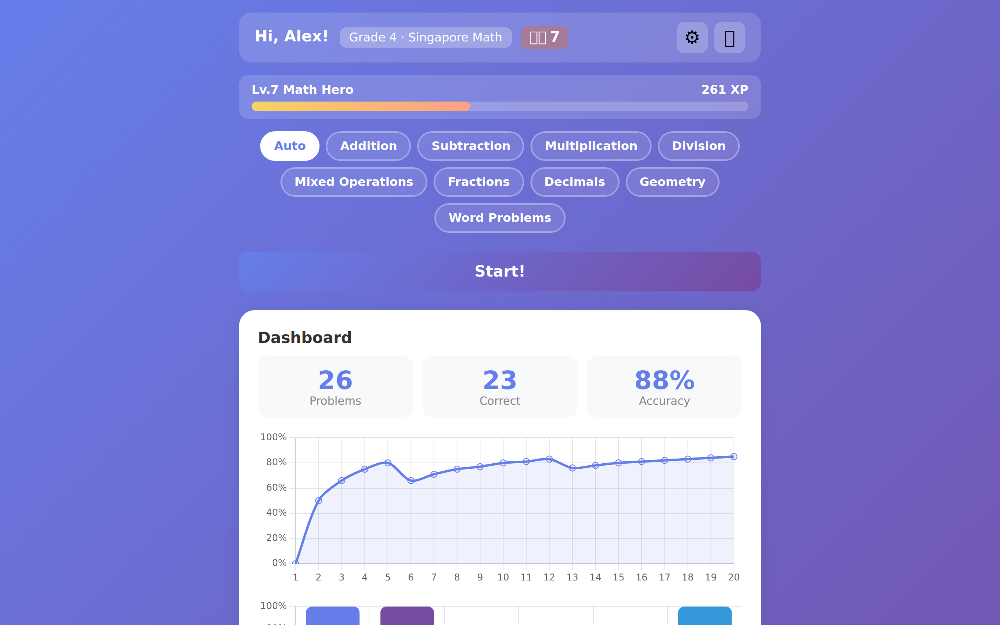
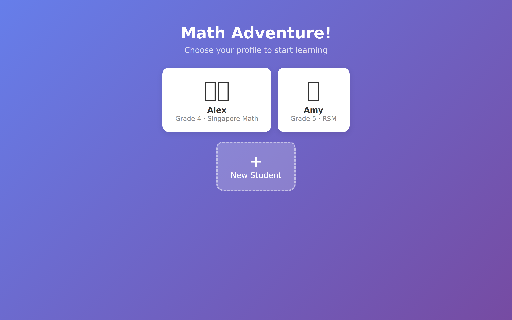
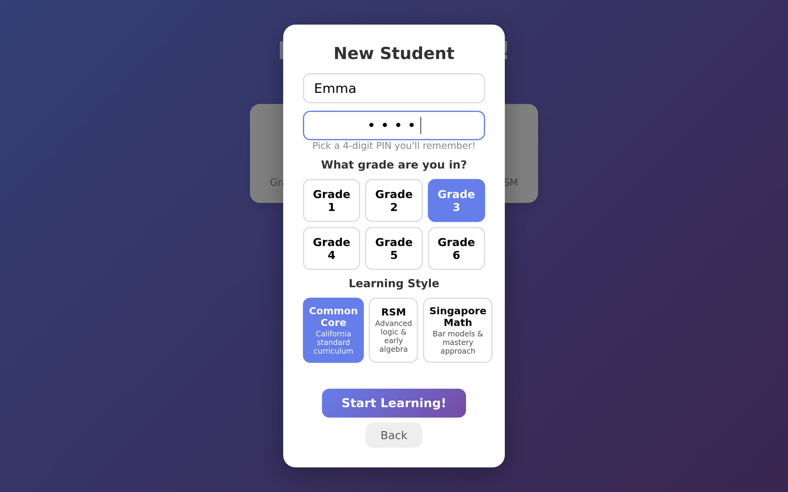
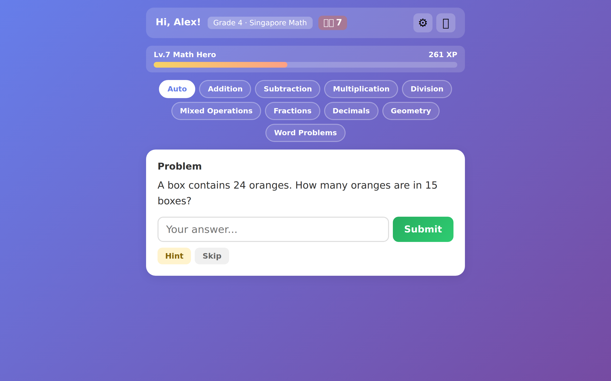
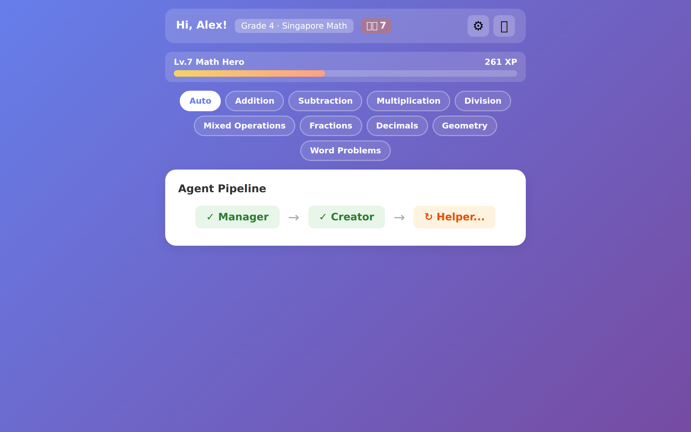
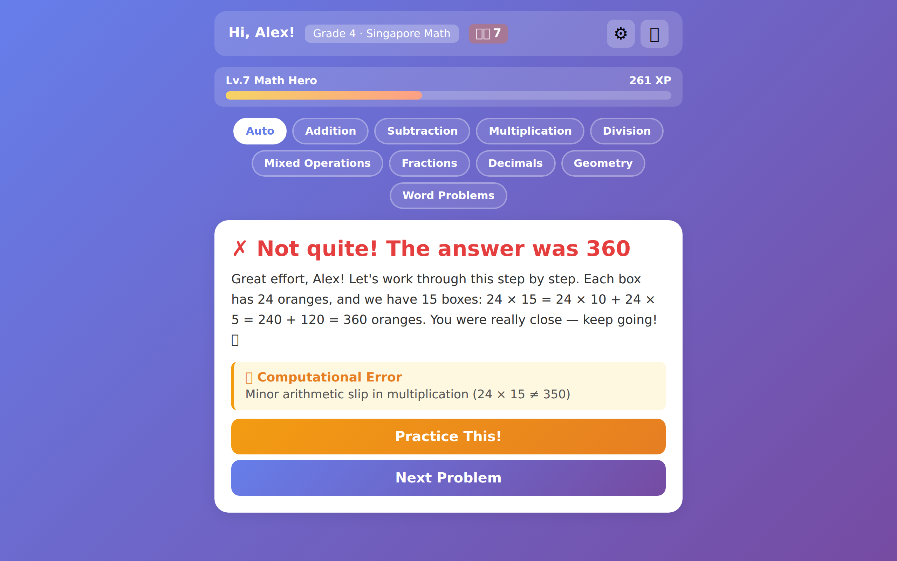
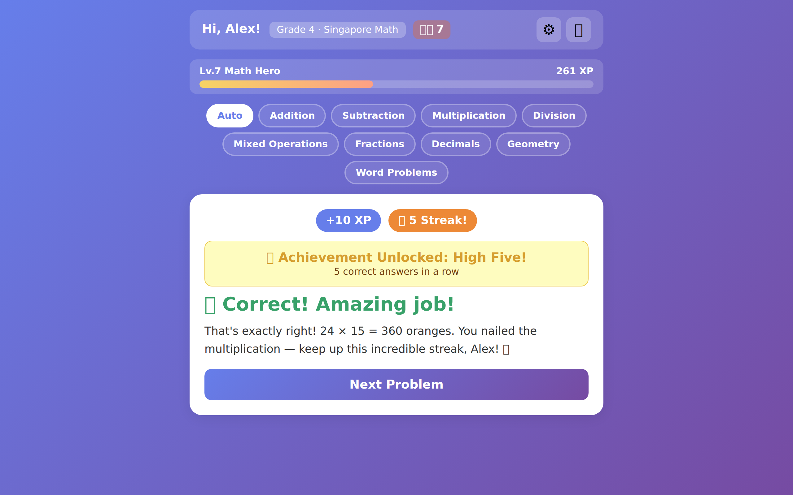
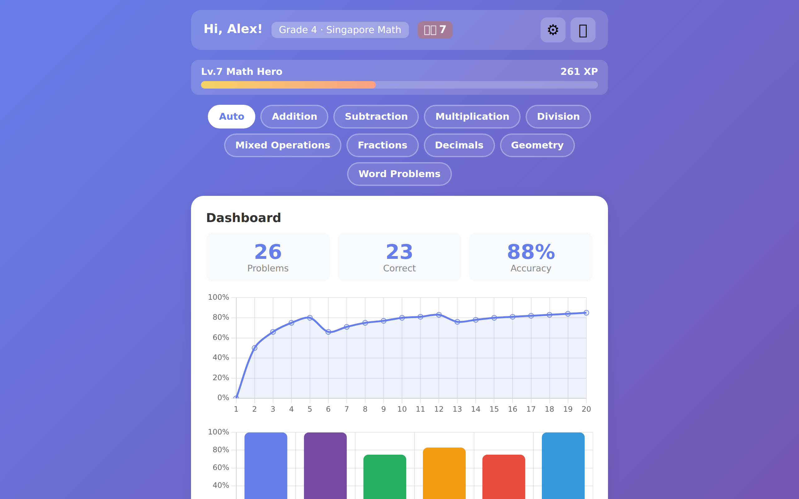

# MathCrew 🧮

**AI-powered adaptive math tutor for kids (Grade 1–6)**

A web-based math learning app for elementary students, powered by a CrewAI multi-agent pipeline with Google Gemini + Ollama hybrid architecture.

### Motivation

Built as a personal project to help my daughter practice math at home, and as an experiment with CrewAI's multi-agent orchestration. What started as a simple worksheet generator evolved into a full adaptive tutoring system.

- 4 AI agents collaborate: problem generation → feedback → error analysis → scaffolded practice
- **Problem Bank** — caches generated problems to save LLM calls (reuses problems with matching conditions)
- **3 curriculum styles**: Common Core · RSM · Singapore Math
- Gamification: XP / levels / streaks / 15 badges / confetti animations
- Multi-student support with PIN login
- Chart.js-powered dashboard

---

## Screenshots



| Login | New Student Setup |
|:---:|:---:|
|  |  |

| Problem | Agent Pipeline |
|:---:|:---:|
|  |  |

| Wrong Answer + Scaffold | Correct Answer + Achievement |
|:---:|:---:|
|  |  |

| Dashboard + Achievements |
|:---:|
|  |

---

## Features

| Feature | Description |
|---------|-------------|
| AI 4-Agent Pipeline | Manager → Creator → Helper → Analyst sequential execution |
| Real-time SSE UI | Live agent pipeline progress displayed in the browser |
| Adaptive Scaffolding | On wrong answers: error analysis (computational/conceptual/procedural/careless) + auto-generated practice problems |
| Problem Bank | Caches problems by grade+style+topic, skips Creator LLM call on cache hit |
| Multi-Curriculum | Choose from Common Core · RSM (Russian Math) · Singapore Math |
| Gamification | XP · Levels (1–50) · Streak bonuses · 15 badges · Confetti animations |
| Multi-Student + PIN | Per-student profiles, PIN protection, independent learning history |
| Dashboard | Accuracy trends · Per-topic performance · Achievement overview (Chart.js) |

---

## Tech Stack

| Layer | Technology |
|-------|-----------|
| Backend | Python 3.10+ / Starlette (async) |
| AI Agents | CrewAI |
| Primary LLM | Google Gemini 2.5 Flash |
| Local LLM | Ollama (gemma3:4b) |
| Database | SQLite3 |
| Realtime | Server-Sent Events (SSE) |
| Frontend | Vanilla JS / Chart.js / canvas-confetti |

---

## Prerequisites

| Requirement | Note |
|-------------|------|
| **Python 3.10+** | Required |
| **Gemini API Key** | Required — see setup guide below |
| **Ollama** | Optional — needed for local LLM |

---

## Quick Start

```bash
# 1. Clone
git clone https://github.com/freesoft/MathCrew.git
cd MathCrew

# 2. Create & activate virtual environment
python -m venv venv
source venv/bin/activate   # Windows: venv\Scripts\activate

# 3. Install dependencies
pip install "crewai[google-genai]" starlette sse-starlette uvicorn python-dotenv

# 4. Configure environment variables
cp .env.example .env       # or create manually
# Add GEMINI_API_KEY=your_key_here to .env

# 5. Run
python web_tutor.py
# → http://localhost:8000
```

---

## Gemini API Key Setup

1. Go to [Google AI Studio](https://aistudio.google.com/)
2. Click **Get API Key** → **Create API Key**
3. Add the key to your `.env` file:
   ```
   GEMINI_API_KEY=your_key_here
   ```
4. **Free tier limits**: 15 requests/min, 1,500 requests/day (as of 2025, subject to change)

---

## Ollama Setup (Optional)

To run the Helper agent locally for faster feedback:

1. Install from [https://ollama.com](https://ollama.com)
2. Pull the model:
   ```bash
   ollama pull gemma3:4b
   ```
3. Configure in `.env`:
   ```
   USE_LOCAL_LLM=true    # (default) Use Ollama for Helper
   USE_LOCAL_LLM=false   # Use Gemini for all agents
   ```

> If Ollama is not installed, set `USE_LOCAL_LLM=false` and all agents will use Gemini.

---

## AI Agent Architecture

```
[Manager] → [Creator] → [Helper] → [Analyst]
   │            │           │           │
  Gemini      Gemini     Ollama      Gemini
                ▲
                │
        [Problem Bank] ── hit → skip Creator (saves LLM call)
```

| Agent | Model | Purpose |
|-------|-------|---------|
| **Learning Manager** | Gemini 2.5 Flash | Analyzes learning history, decides next problem direction |
| **Problem Creator** | Gemini 2.5 Flash | Generates grade- and topic-appropriate math problems (JSON output) |
| **Solution Helper** | Ollama gemma3:4b | Encouraging feedback on correct/wrong answers, step-by-step explanations |
| **Misconception Analyst** | Gemini 2.5 Flash | Error analysis — computational / conceptual / procedural / careless |

> Why only Helper uses a local model: immediate feedback needs speed, while accurate problem generation and analysis require Gemini's accuracy.

---

## Problem Bank

Generated problems are cached in the `problem_bank` table and reused when the same conditions (grade + curriculum_style + topic) are requested.

- **Regular problems**: After Manager runs, extract topic → query bank → on hit, skip Creator (saves 1 LLM call)
- **Scaffold problems**: Query bank → on hit, skip Creator (saves all LLM calls — no Manager for scaffolds)
- Compares against each student's last 20 problems to avoid serving duplicates
- Sorted by `times_served ASC, RANDOM()` — least-served problems are prioritized

---

## Curriculum Styles

| Style | Approach |
|-------|----------|
| **Common Core** | Conceptual understanding + real-world problems, visual models (number lines, tape diagrams) |
| **RSM** | Logical reasoning + algebraic thinking, 1–2 years ahead of standard curriculum |
| **Singapore Math** | CPA (Concrete-Pictorial-Abstract) approach, bar models, number sense mastery |

Students can select their curriculum style during profile creation or in settings. The chosen style determines per-grade scope and pedagogy injected into all agent prompts.

---

## Environment Variables

| Variable | Required | Default | Description |
|----------|----------|---------|-------------|
| `GEMINI_API_KEY` | **Yes** | — | Google Gemini API key |
| `USE_LOCAL_LLM` | No | `true` | `true` = use Ollama for Helper, `false` = use Gemini for all |

---

## Project Structure

```
MathCrew/
├── web_tutor.py        # Web server + API routes + CrewAI agent pipeline + Problem Bank logic
├── db.py               # SQLite schema + Problem Bank + gamification logic (XP/levels/achievements)
├── math_tutor.py       # CLI version (standalone, runs in terminal without web)
├── templates/
│   └── index.html      # Frontend SPA (Vanilla JS + Chart.js + confetti)
├── .env                # API keys (gitignored)
├── .gitignore
└── README.md
```

---

## Customization Guide

### Changing Models

Edit LLM configuration in `web_tutor.py`:

```python
# Change Gemini model
gemini_llm = LLM(model="gemini/gemini-2.5-pro", api_key=...)

# Change local model
local_llm = LLM(model="ollama/llama3:8b", base_url="http://localhost:11434")
```

### Editing Curriculum

Modify the `CURRICULUM_STYLES` dict in `web_tutor.py`:

```python
CURRICULUM_STYLES = {
    "common_core": {
        "display_name": "Common Core",
        "pedagogy": "Focus on conceptual understanding...",
        "grades": {
            1: "Addition and subtraction within 20...",
            # ... edit per-grade scope
        },
    },
    # Add new styles here
}
```

### Topic List

Update both `KNOWN_TOPICS` in `web_tutor.py` and the `TOPICS` array in `templates/index.html`.

### Adding Achievements

Add a new entry to the `ACHIEVEMENTS` dict in `db.py`, then add the condition in `check_achievements()`:

```python
# Add to ACHIEVEMENTS
"new_badge": {"name": "Badge Name", "icon": "🎖️", "desc": "Description"}

# Add condition in check_achievements()
"new_badge": some_condition,
```

### XP Formula

In `db.py` `get_gamification_stats()`:
- Correct answer: **10 XP**
- Scaffold correct: **8 XP**
- Wrong answer: **2 XP**
- Streak bonuses: 3-streak +3, 5-streak +5, 10-streak +10, 20-streak +20

### Level Formula

```python
level = min(int(0.4 * sqrt(xp)) + 1, 50)
```

---

## API Endpoints

| Method | Endpoint | Description |
|--------|----------|-------------|
| `GET` | `/` | Main page (index.html) |
| `GET` | `/api/students` | List all students |
| `GET` | `/api/student` | Current logged-in student info |
| `POST` | `/api/login` | PIN login |
| `POST` | `/api/setup` | Create/update student profile |
| `POST` | `/api/logout` | Logout |
| `POST` | `/api/new-problem` | Generate new problem (runs agent pipeline) |
| `POST` | `/api/submit-answer` | Submit answer + grading |
| `POST` | `/api/skip` | Skip current problem |
| `POST` | `/api/scaffold-problem` | Generate scaffold practice problem after wrong answer |
| `GET` | `/api/gamification` | XP · level · streak status |
| `GET` | `/api/achievements` | Achievement/badge list + unlock status |
| `GET` | `/api/stats` | Per-topic accuracy stats |
| `GET` | `/api/score-over-time` | Score trend data over time |
| `GET` | `/api/history` | Full problem history |
| `GET` | `/api/events` | SSE stream (real-time agent status) |

---

## License

MIT
